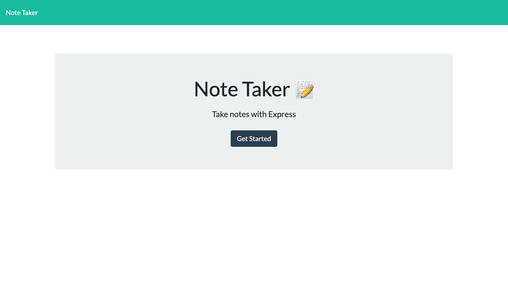

# Note-Taker
   

  ## Description
  Note-Taker is a front and backend  web application which allows a user to create, save, and edit notes.  The notes are then saved to a file to be accessed at a later time.
  
  ## Table of Contents
  * [Desciption](#description)
  * [Installation](#installation)
  * [Usage](#usage)
  * [License](#license)
  * [Contributing](#contributing)
  * [Tests](#tests)
  * [Questions](#questions)
  ## Installation
  No installation is required for use Note-Taker is deployed with heroku at https://boiling-hollows-19999.herokuapp.com/.
  ## License
  MIT License
  ## Contributing
  To contribute clone the repo and address any unresolved issues then commits will be aproved after review.  Areas of development to focus on are delete functionality.
  ## Questions
  For any questions reach out on [GitHub](https://github.com/PaulKup) or by email: kupiszewskist1@gmail.com

